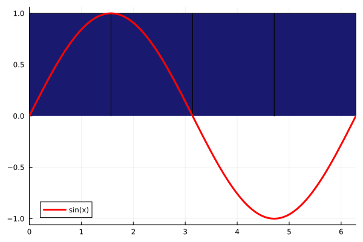

# AdaptiveDensityApproximation.jl

[](https://antibodypackages.github.io/AdaptiveDensityApproximation-documentation/)

A [Julia](https://julialang.org/) package for the approximation of density functions with discrete grids that can be refined adaptively. Simple calculations are implemented, e.g. the sum and product of approximated density coefficients or a rudimentary numerical integration of approximated densities. Integral models can be approximated for the inference of densities. In case of probability densities, empirical PDF and CDF functions can be constructed.

 

## Installation

The package can be installed with the following commands

```julia
using Pkg
Pkg.Registry.add()
Pkg.Registry.add(RegistrySpec(url = "https://github.com/AntibodyPackages/AntibodyPackagesRegistry"))
Pkg.add("AdaptiveDensityApproximation")
```
Since the package is not part of the `General` registry the commands install the additional registry `AntibodyPackagesRegistry` first.

After the installation, the package can be used like any other package:
```julia
using AdaptiveDensityApproximation
```

## Resources

* **Documentation:** [https://antibodypackages.github.io/AdaptiveDensityApproximation-documentation/](https://antibodypackages.github.io/AdaptiveDensityApproximation-documentation/)
